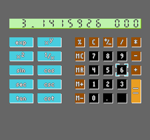

# NES Calculator

Scientific calculator for NES, based on http://www.crbond.com/calc65.htm and inspired by [this tweet](https://twitter.com/HackerVilela/status/1392232779371397121).



## Usage

* D-pad: moves button cursor
* A: press a button
* B: toggles between `exp` and `log` buttons, between `square` and `square root` buttons, and between normal, inverse, hyperbolic and inverse hyperbolic trigonometric buttons.

## Compiling

First, install [cc65](https://github.com/cc65/cc65). Then run

```sh
$ make
```

to build the `calculator.nes` ROM.

Other targets are available as well:

```sh
$ make debug # will build with a DEBUG flag; for now only used for "tint" to indicate CPU usage
$ make run # will build the debug target then run on an emulator (see `EMULATOR` variable on the `Makefile`)
$ make usage # computes information about ROM/RAM usage, based on ld map output
```
